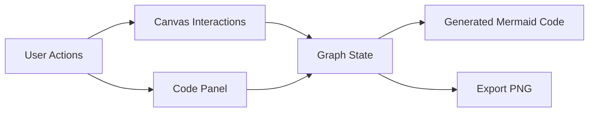
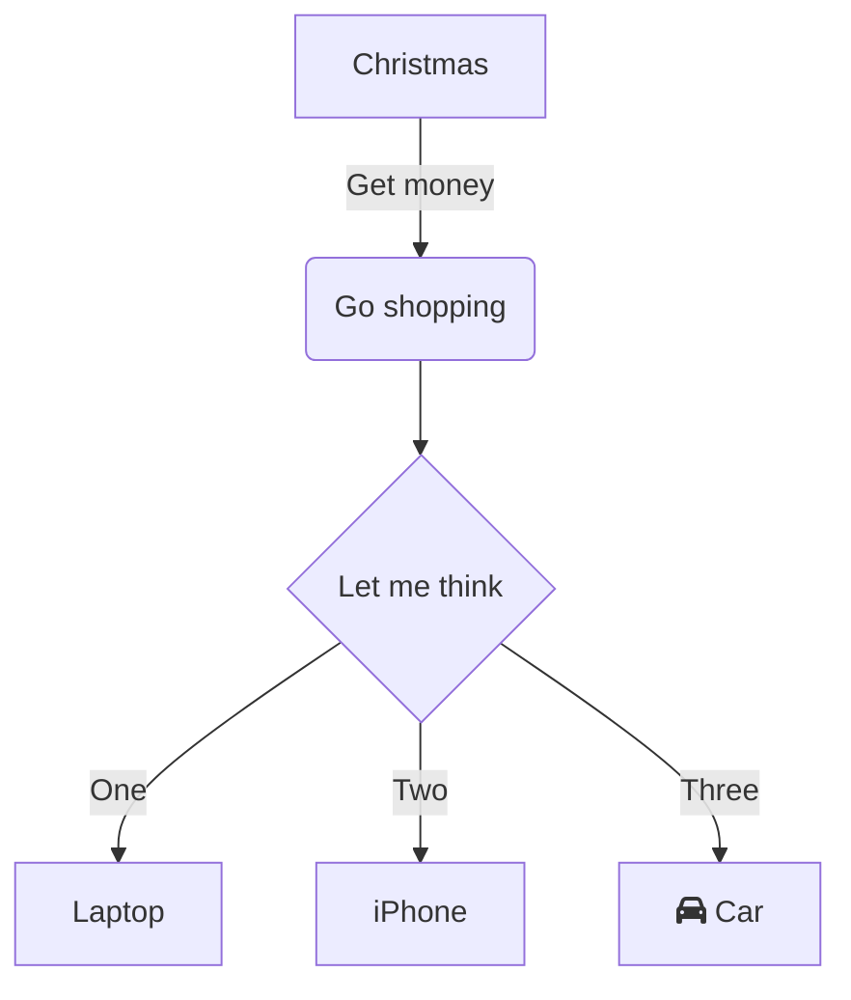

<div align="center">

# Mermaid Flowchart Editor

Visual flowchart builder with real-time Mermaid code synchronization.

<p>
  
  
  
  <a href="https://github.com/WaficMikati"></a>
</p>

</div>

## Overview

This app lets you build flowcharts visually on a grid canvas while keeping Mermaid code editable and synchronized.

It supports drag-and-drop creation, inline editing, connection labeling, multi-selection, code apply/cancel flows, and PNG export.


## Visual Architecture



## Core Capabilities

| Area | Capabilities |
|---|---|
| Node authoring | Drag-and-drop shapes, auto labels, adaptive sizing |
| Edge authoring | Drag-to-connect, directional arrows, inline edge labels |
| Editing | Inline node text edit, outside-click apply, Enter apply, Escape cancel |
| Selection | Box select, multi-select, group drag, delete selected |
| Navigation | Scroll zoom, right-click pan, reset zoom, center |
| Mermaid sync | Apply code to rebuild graph, generate code from graph state |
| Localization | EN/ES language toggle with persistence |
| Output | PNG export |

## Supported Mermaid Syntax (Current Subset)

- Node declarations:
  - `A[Process]`
  - `B(Start/End)`
  - `C{Decision}`
  - `D((Connector))`
  - `E([Stadium])`
- Edges:
  - `A --> B`
  - `A -->|label| B`
- Flow direction:
  - `flowchart TD`, `LR`, `RL`, `BT`

Example:



## Quick Start

### Install dependencies

```bash
npm install
```

### Start development server

```bash
npm run dev
```

### Build for production

```bash
npm run build
```

### Preview production build

```bash
npm run preview
```

## Scripts

| Command | Description |
|---|---|
| `npm run dev` | Start local dev server |
| `npm run build` | Build production assets to `dist/` |
| `npm run build:pages` | Build static output to `site/` |
| `npm run preview` | Preview production build locally |
| `npm run lint` | Run ESLint |

## Project Structure

```text
.
|-- mermaid/index.html            # Editor page entry
|-- src/
|   |-- App.jsx                   # Main editor implementation
|   `-- main.jsx                  # React bootstrap
|-- vite.config.js                # Vite multi-page config
`-- package.json
```

## Notes

- Main editor logic is intentionally centralized in `src/App.jsx` for fast iteration.
- Language preference is stored in `localStorage`.
